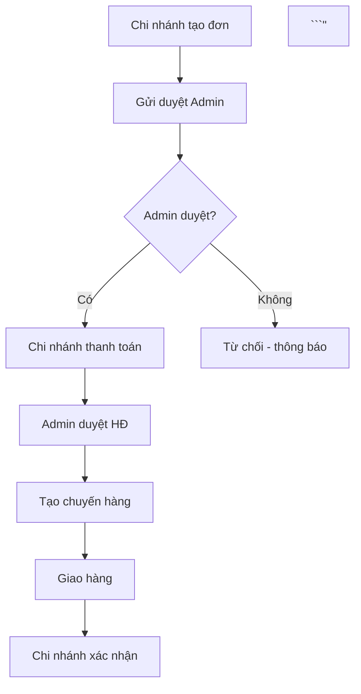

# Upgrade v3 — Phân tích 14 yêu cầu nâng cấp

> Ngày phân tích: 2026-06-08  
> Dựa trên: code hiện tại (Laravel 11 + Next.js 14)  
> Trạng thái: **G1 ~97% · G2 ~92% · G3 100%** (2026-06-08) · Task tick: [backend-tasks.md](../../tasks/backend-tasks.md) · [frontend-tasks.md](../../tasks/frontend-tasks.md) · [STATUS.md](../../tasks/STATUS.md)

---

## Tổng quan ưu tiên

| # | Nhóm | Yêu cầu | Priority | Estimate BE | Estimate FE |
|---|------|---------|----------|-------------|-------------|
| 12 | Order Flow | Thiết kế lại luồng đặt hàng hoàn chỉnh | **P0** | 3d | 2d |
| 3 | Pricing | Phân quyền giá (cost/retail/branch) | **P0** | 4h | 4h |
| 6 | Inventory | Nhập kho đúng quy trình | **P0** | 2d | 1.5d |
| 9 | Dashboard | Phân quyền Dashboard theo role | **P1** | 4h | 4h |
| 8 | Dashboard | Doanh thu/tài chính + lọc theo tháng | **P1** | 1d | 1d |
| 1 | AI Review | Hiển thị ảnh khi duyệt sản phẩm AI | **P1** | 1h | 2h |
| 2 | Product | Form sản phẩm: Quy cách + người thêm + validation | **P1** | 3h | 4h |
| 4 | Notify | Thông báo admin khi có sản phẩm AI mới duyệt | **P1** | 4h | 3h |
| 5 | Visibility | Chi nhánh thấy đơn + hàng hóa đã/chưa duyệt | **P1** | 3h | 3h |
| 7 | UX | Thêm required field validation toàn bộ form | **P2** | 2h | 4h |
| 10 | MasterData | UI quản lý danh mục + constants | **P2** | 4h | 1d |
| 13 | Mobile | Responsive mobile cho tất cả màn hình | **P2** | — | 2d |
| 14 | Profile | User cập nhật profile + ảnh đại diện | **P2** | 4h | 4h |
| 11 | AI | AI chat tạo sơ đồ/diagram trong chat | **P3** | 3h | 2h |

---

## #1 — Hiển thị ảnh khi duyệt sản phẩm AI

### Hiện trạng
`AiProductCandidate` đã có `image_url` (string). Frontend `AiProductCandidatesScreen` không render ảnh thumbnail trong bảng duyệt.

### Giải pháp
Frontend-only fix — thêm `<Image>` thumbnail 60×60 vào cột đầu bảng danh sách candidates.

### Thay đổi
**FE**: `components/screens/AiProductCandidatesScreen.tsx`
- Thêm cột "Ảnh" (60×60 thumbnail, fallback placeholder)
- Hiển thị `image_url` từ `AiProductCandidateResource`

**Domain**: Không thay đổi API/BE

---

## #2 — Form sản phẩm: Quy cách, người thêm, required fields

### "Quy cách" là gì?
Trường `spec` hiện tại = **Quy cách đóng gói** ví dụ:
- `120 viên / hộp`
- `500ml / chai`
- `30 gói × 5g`

→ Đổi label từ "Spec" thành **"Quy cách đóng gói (Spec)"** và thêm placeholder ví dụ.

### Thêm "Người thêm sản phẩm"
`Product` đã có `created_user_id` (int). Cần:
- BE: `ProductResource` resolve tên người dùng từ `created_user_id`
- FE: Hiển thị "Thêm bởi: Admin" trong product detail

### Fields cần bổ sung vào Product form (admin)

| Field | Hiện tại | Đề xuất |
|-------|---------|---------|
| `product_name` | Có | Required ✓ |
| `product_name_jp` | Có | Required ✓ |
| `product_category_id` | Có | Required ✓ |
| `spec` | Có (label: "Spec") | Đổi label → "Quy cách đóng gói", required |
| `unit` | Có | Required (dropdown: hộp/chai/gói/cái/kg) |
| `origin` | Có | Required (default: Nhật Bản) |
| `cost_jpy` | Có | Required cho admin |
| `price_vnd` | Có | Required |
| `barcode` | ❌ Thiếu | Thêm optional — `barcode` VARCHAR(50) |
| `min_order_qty` | ❌ Thiếu | Thêm optional — số lượng đặt tối thiểu |
| `created_by_name` | ❌ Hiển thị | Readonly, resolve từ `created_user_id` |

### Thay đổi
**BE**:
- Migration: `products` thêm `barcode`, `min_order_qty`
- `ProductResource`: thêm `created_by_name` (join admin/company/branch_user theo `created_user_id`)
- `StoreProductRequest`: thêm required validation

**FE**:
- `ProductFormModal.tsx` / `ProductDetailScreen.tsx`: đổi label, thêm field mới

---

## #3 — Phân quyền giá (Pricing Permissions)

### Hiện trạng
`ProductResource` ẩn `cost_price_jpy` (giá gốc) với non-admin — đúng một phần.

### Thiết kế mới

| Field | Admin | Company (Đại lý JP) | Branch (Chi nhánh VN) | Public/Guest |
|-------|-------|--------------------|-----------------------|-------------|
| `cost_jpy` (giá gốc nhật) | ✅ | ❌ ẩn | ❌ ẩn | ❌ |
| `selling_price_jpy` (giá bán JP) | ✅ | ✅ | ❌ ẩn | ❌ |
| `price_vnd` (giá bán VN = giá chi nhánh nhập) | ✅ | ✅ | ✅ | ❌ |
| `retail_price_vnd` (giá lẻ gợi ý) | ✅ | ✅ | ✅ | ❌ |
| `cost_price_jpy` (giá gốc mới) | ✅ | ❌ | ❌ | ❌ |
| `fee_rate` | ✅ | ❌ | ❌ | ❌ |

**Thêm field `retail_price_vnd`** vào `products` — giá lẻ gợi ý cho người tiêu dùng cuối. Chi nhánh sẽ bán lẻ theo giá này.

### Thay đổi
**BE**: 
- Migration: thêm `retail_price_vnd` vào `products`
- `ProductResource`: cập nhật logic phân quyền price fields
- `StoreProductRequest`: thêm `retail_price_vnd` validation

**FE**:
- Product form admin: thêm field `retail_price_vnd`
- Branch product view: chỉ hiện `price_vnd` + `retail_price_vnd`

---

## #4 — Thông báo admin khi sản phẩm AI mới cần duyệt

### Thiết kế Notification System

```sql
CREATE TABLE notifications (
  id           BIGINT UNSIGNED AUTO_INCREMENT PRIMARY KEY,
  user_type    ENUM('admin','company','branch') NOT NULL,
  user_id      BIGINT UNSIGNED NOT NULL,
  type         VARCHAR(50) NOT NULL,  -- 'AI_CANDIDATE_PENDING', 'ORDER_CONFIRMED', etc.
  title        VARCHAR(200) NOT NULL,
  body         TEXT,
  data_type    VARCHAR(50),           -- 'ai_candidate', 'order', 'invoice'
  data_id      BIGINT UNSIGNED,       -- ID của object liên quan
  is_read      TINYINT(1) DEFAULT 0,
  created_at   TIMESTAMP DEFAULT CURRENT_TIMESTAMP,
  INDEX idx_user (user_type, user_id, is_read),
  INDEX idx_created (created_at)
);
```

### Các loại thông báo (type)

| Type | Trigger | Người nhận |
|------|---------|------------|
| `AI_CANDIDATE_PENDING` | Branch/Company submit AI candidate | Admin |
| `ORDER_CONFIRMED` | Admin confirm order | Branch/Company |
| `ORDER_APPROVED` | Admin approve order | Branch |
| `INVOICE_CREATED` | System tạo invoice tự động | Admin |
| `INVOICE_APPROVED` | Admin approve invoice | Branch |
| `SHIPMENT_SHIPPING` | Admin đổi trạng thái SHIPPING + nhập tracking | Branch |
| `SHIPMENT_DELIVERED` | Admin đổi DELIVERED_ADMIN | Branch |
| `PAYMENT_RECEIVED` | Admin xác nhận thanh toán | Branch |

### API
- `GET /notifications` — danh sách, filter `is_read`
- `PUT /notifications/{id}/read` — đánh dấu đã đọc
- `PUT /notifications/read-all` — đọc tất cả
- `GET /notifications/count` — số chưa đọc (dùng cho badge header)

### Thay đổi
**BE**: Migration + Model + NotificationService + NotificationController + inject vào các service liên quan
**FE**: Header badge hiện số unread (đã có infrastructure từ `useNotificationCounts`)

---

## #5 — Chi nhánh xem đơn + hàng hóa đã/chưa duyệt

### Hiện trạng
Branch đã xem được đơn hàng của mình. Thiếu:
1. Xem trạng thái hàng hóa AI đã submit (PENDING/APPROVED/REJECTED)
2. Xem danh sách hàng hóa đã duyệt (catalog active)

### Giải pháp

**Đơn hàng của chi nhánh**: Đã có — không thay đổi.

**Hàng hóa AI candidates**: 
- `GET /ai/candidates?created_user_type=branch_*&created_user_id={id}` — branch xem candidates mình đã submit
- Hiện tại đã filter theo user — cần verify frontend đang show status đúng

**Hàng hóa catalog**:
- Branch xem `GET /products?status=active` — hàng đã duyệt
- Thêm filter `approved_only=true` để phân biệt

---

## #6 — Nhập kho đúng quy trình

### Vấn đề hiện tại
1. Không có `inventory_cd` — không có mã kho riêng cho từng lô
2. Không thể edit/delete record kho cụ thể
3. Không có trạng thái kho (đủ / cần nhập / đang đặt hàng)
4. `Warehouse` không phân biệt kho JP vs kho VN
5. Không có ETA nhập hàng tiếp theo

### Thiết kế mới

#### Bổ sung Warehouse.location_type
```sql
ALTER TABLE warehouses ADD COLUMN location_type ENUM('JP', 'VN') DEFAULT 'VN' AFTER country;
ALTER TABLE warehouses ADD COLUMN is_default TINYINT(1) DEFAULT 0 AFTER location_type;
```

Quy trình 2 kho:
```
[Kho JP] (hàng chưa xuất)
    ↓ Tạo ShipmentBatch → trạng thái PREPARING
    ↓ Khi admin đổi → SHIPPING
    ↓ Khi admin đổi → DELIVERED_ADMIN (hàng đến kho VN)
[Kho VN] (quantity tăng qua stockIn)
    ↓ Branch đặt hàng → reserved_qty tăng
    ↓ Branch confirm receipt → stockOut
```

#### Bổ sung Inventory fields
```sql
ALTER TABLE inventories ADD COLUMN inventory_cd VARCHAR(20) UNIQUE AFTER id;  
-- Format: INV-{WAREHOUSE_CD}-{PRODUCT_CD}-{SEQ3}  e.g. INV-HN01-FOD00012-001
ALTER TABLE inventories ADD COLUMN restock_status ENUM('NORMAL','LOW','CRITICAL','ON_ORDER') DEFAULT 'NORMAL';
ALTER TABLE inventories ADD COLUMN restock_eta DATE NULL COMMENT 'Ngày dự kiến có hàng';
ALTER TABLE inventories ADD COLUMN min_stock_qty INT DEFAULT 5 COMMENT 'Ngưỡng tồn kho tối thiểu';
ALTER TABLE inventories ADD COLUMN last_restock_at TIMESTAMP NULL;
ALTER TABLE inventories ADD COLUMN notes TEXT NULL;
```

#### Quy trình nhập kho mới

```
Bước 1: Admin chọn sản phẩm + kho + số lượng + lô hàng
         → Hệ thống sinh inventory_cd tự động
         → inventory record được tạo hoặc cập nhật

Bước 2: Khi ShipmentBatch → DELIVERED_ADMIN
         → stockIn() tự động tăng quantity kho VN
         → restock_status → NORMAL nếu > min_stock_qty

Bước 3: Auto-monitor tồn kho
         → Scheduler kiểm tra daily: nếu available_qty < min_stock_qty → restock_status = LOW/CRITICAL
         → Dashboard hiện cảnh báo kho
```

#### Form nhập kho mới
```
Nhập kho sản phẩm
─────────────────────────────────────────
Sản phẩm: [dropdown search — tên + mã]
Kho:      [dropdown: Kho VN - Hà Nội | Kho JP]  
Số lượng: [number, required]
Giá nhập: [JPY, optional — cho record]
Lô hàng:  [text, optional]
Ghi chú:  [text, optional]
Ngưỡng cảnh báo tồn kho tối thiểu: [number, default 5]
─────────────────────────────────────────
Mã kho tự động: INV-HN01-FOD00012-001
[Lưu]
```

#### Bulk nhập kho
- Upload CSV: `product_cd, quantity, warehouse_cd, batch_no`
- API: `POST /inventories/bulk` — xử lý array input

---

## #7 — Required fields validation toàn form

### Danh sách form + fields bắt buộc thiếu

| Form | Fields cần thêm required |
|------|--------------------------|
| Product form | `spec`, `unit`, `origin`, `cost_jpy` |
| Order form | `delivery_address`, `expected_delivery_date` |
| Invoice form | `due_date`, `payment_method` |
| Inventory form | `quantity`, `warehouse_id` |
| Shipment form | `carrier_name`, `estimated_arrival` |
| Branch form | `address`, `tel` |
| Company form | `company_name_jp`, `tax_code` |

**FE**: Thêm `required` attribute + error message hiển thị rõ ràng
**BE**: Form Request đã có nhưng cần review lại từng request

---

## #8 — Dashboard tài chính + lọc theo tháng

### Thêm vào DashboardService

#### Endpoints mới
```
GET /dashboard/stats          (đã có, mở rộng thêm fields)
GET /dashboard/revenue?year=2026&month=6
GET /dashboard/cashflow?year=2026&from_month=1&to_month=6
```

#### Revenue stats (theo tháng)
```json
{
  "year": 2026,
  "month": 6,
  "revenue_vnd": 125000000,
  "revenue_jpy": 735294,
  "orders_count": 23,
  "orders_completed": 18,
  "avg_order_value_vnd": 5434782,
  "top_products": [...],
  "daily_chart": [
    {"date": "2026-06-01", "revenue": 4500000, "orders": 2},
    ...
  ]
}
```

#### Cashflow
```json
{
  "period": "2026-01 to 2026-06",
  "monthly": [
    {
      "month": "2026-01",
      "revenue": 98000000,
      "cost_import": 55000000,
      "gross_profit": 43000000,
      "gross_margin_pct": 43.9,
      "outstanding_debt": 12000000
    }
  ],
  "summary": {
    "total_revenue": 520000000,
    "total_cost": 310000000,
    "total_profit": 210000000,
    "avg_margin_pct": 40.4
  }
}
```

#### Widget mới trên Dashboard
- **Doanh thu tháng** vs tháng trước (% change)
- **Lợi nhuận gộp** (revenue - cost_import)
- **Tỷ lệ margin** %
- **Công nợ tổng** (outstanding invoices)
- **Chart**: Line chart doanh thu 6 tháng gần nhất
- **Filter**: Year/Month picker

---

## #9 — Dashboard phân quyền theo role

### Hiện trạng
`DashboardService.stats()` có check `userType` nhưng không đủ chi tiết.

### Phân quyền mới

| Widget | Admin | Company | Branch Manager | Branch Staff |
|--------|-------|---------|----------------|--------------|
| Tổng doanh thu toàn hệ thống | ✅ | ❌ | ❌ | ❌ |
| Doanh thu công ty mình | ❌ | ✅ | ❌ | ❌ |
| Doanh thu chi nhánh mình | ❌ | ❌ | ✅ | ✅ |
| Đơn hàng toàn hệ thống | ✅ | ❌ | ❌ | ❌ |
| Đơn hàng công ty/chi nhánh | ❌ | ✅ | ✅ | ✅ |
| Tồn kho (tất cả) | ✅ | ❌ | ❌ | ❌ |
| Cảnh báo tồn kho | ✅ | ❌ | ❌ | ❌ |
| Công nợ (tất cả) | ✅ | ❌ | ❌ | ❌ |
| Công nợ của mình | ❌ | ✅ | ✅ | ✅ |
| Doanh thu/tài chính chi tiết | ✅ | ✅ | ❌ | ❌ |

**Branch staff** chỉ thấy:
- Số đơn của chi nhánh mình
- Công nợ chi nhánh mình
- Sản phẩm tồn kho (xem, không có số liệu chi tiết)

---

## #10 — UI quản lý danh mục + constants

### Master Data Management Screen (`/admin/master-data`)

Chức năng:
1. **Danh mục sản phẩm** (product_categories) — CRUD
2. **Danh sách kho** (warehouses) — CRUD  
3. **Đơn vị tính** (units) — xem/thêm: hộp, chai, gói, cái, kg, ...
4. **Nhà cung cấp JP** (suppliers_jp) — CRUD

Thiết kế màn hình:
```
/admin/master-data
├── Tab: Danh mục sản phẩm
├── Tab: Nhà cung cấp
├── Tab: Kho hàng
└── Tab: Đơn vị tính
```

**Chỉ Admin** được truy cập.

---

## #11 — AI Chat tạo sơ đồ/diagram

### Thiết kế
Khi người dùng hỏi AI về luồng quy trình, AI có thể trả về **Mermaid diagram** dạng text, và frontend render thành sơ đồ.

**Ví dụ:**
```
User: "Vẽ cho tôi quy trình đặt hàng"
AI: "Đây là quy trình đặt hàng:



**Thay đổi:**
- FE: `AiStaffChatWidget.tsx` — detect `mermaid` code block → render `<MermaidDiagram>` component
- Dùng `mermaid.js` CDN (đã có trong artifact whitelist)

---

## #12 — Thiết kế lại luồng đặt hàng hoàn chỉnh

### Luồng hiện tại
```
DRAFT → PENDING → CONFIRMED → PROCESSING → DELIVERED_ADMIN → COMPLETED
                                                             → CANCELLED
```

### Luồng mới đề xuất
```
DRAFT 
  ↓ (Branch gửi)
PENDING 
  ↓ (Admin duyệt)
APPROVED ← MỚI
  ↓ (Branch thanh toán — chuyển khoản/tiền mặt/nợ chuyến)
PAID ← MỚI
  ↓ (Tự động: Tạo Invoice + Tạo ShipmentBatch trạng thái PREPARING)
PROCESSING (ShipmentBatch đang chuẩn bị)
  ↓ (Admin đổi: nhập mã vận đơn)
SHIPPING ← MỚI
  ↓ (Hàng đến kho)
DELIVERED_ADMIN
  ↓ (Branch xác nhận nhận hàng)
COMPLETED
```

### Bảng so sánh luồng

| Bước | Cũ | Mới |
|------|-----|-----|
| Branch tạo đơn | DRAFT | DRAFT |
| Branch gửi duyệt | PENDING | PENDING |
| Admin duyệt | CONFIRMED | **APPROVED** |
| Branch thanh toán | (ngoài luồng) | **PAID** (trong luồng) |
| Hệ thống tự tạo HĐ | Thủ công | **Auto khi PAID** |
| Admin duyệt HĐ | Thủ công | **Auto nếu payment verified** |
| Tạo chuyến hàng | Thủ công | **Auto khi PAID** |
| Admin nhập tracking | ❌ không có | **SHIPPING + tracking_no** |
| Branch xem tracking | ❌ | ✅ |
| Branch xác nhận | DELIVERED_ADMIN → COMPLETED | DELIVERED_ADMIN → COMPLETED |

### Thay đổi database

```sql
-- orders: thêm status APPROVED, PAID, SHIPPING
-- Enum update (MySQL):
ALTER TABLE orders MODIFY COLUMN status ENUM(
  'DRAFT','PENDING','APPROVED','PAID',
  'PROCESSING','SHIPPING','DELIVERED_ADMIN','COMPLETED','CANCELLED'
);

-- Thêm payment fields vào orders
ALTER TABLE orders ADD COLUMN payment_method ENUM('bank_transfer','cash','credit') NULL;
ALTER TABLE orders ADD COLUMN payment_at TIMESTAMP NULL;
ALTER TABLE orders ADD COLUMN payment_ref VARCHAR(100) NULL COMMENT 'Mã chuyển khoản / biên lai';
ALTER TABLE orders ADD COLUMN payment_note TEXT NULL;
ALTER TABLE orders ADD COLUMN approved_at TIMESTAMP NULL;
ALTER TABLE orders ADD COLUMN approved_by INT NULL;

-- Thêm tracking vào shipment_batches
ALTER TABLE shipment_batches ADD COLUMN tracking_no VARCHAR(100) NULL;
ALTER TABLE shipment_batches ADD COLUMN carrier_name VARCHAR(100) NULL;
ALTER TABLE shipment_batches ADD COLUMN shipping_at TIMESTAMP NULL;
ALTER TABLE shipment_batches ADD COLUMN estimated_arrival DATE NULL;
```

### Thay đổi OrderService

```php
// Thêm các function mới:
public function approve(int $id, Admin $admin): Order     // PENDING → APPROVED
public function recordPayment(int $id, array $paymentData): Order  // APPROVED → PAID
public function startShipping(int $id, array $trackingData): Order // PROCESSING → SHIPPING
```

### Thay đổi ShipmentBatchService

```php
// Tự động tạo khi order PAID:
public function autoCreateFromOrder(Order $order): ShipmentBatch

// Tự động đổi sang SHIPPING khi admin nhập tracking:
public function setTracking(int $id, string $trackingNo, string $carrier): ShipmentBatch
```

### Notification tại mỗi bước

| Bước | Thông báo | Người nhận |
|------|-----------|------------|
| PENDING | "Đơn #{order_no} cần duyệt" | Admin |
| APPROVED | "Đơn #{order_no} đã được duyệt, vui lòng thanh toán" | Branch |
| PAID | "Đơn #{order_no} đã thanh toán, đang chuẩn bị hàng" | Admin |
| SHIPPING | "Đơn #{order_no} đang vận chuyển — Mã: {tracking_no}" | Branch |
| DELIVERED_ADMIN | "Đơn #{order_no} đã đến kho, vui lòng xác nhận nhận hàng" | Branch |
| COMPLETED | "Đơn #{order_no} hoàn thành" | Admin + Branch |

---

## #13 — Mobile Responsive

### Breakpoints cần thiết

```css
Mobile: < 640px  → sm
Tablet: 640–1024px → md  
Desktop: > 1024px → lg
```

### Màn hình ưu tiên responsive

| Màn hình | Vấn đề chính |
|----------|--------------|
| `AppShell` | Sidebar collapse thành bottom nav trên mobile |
| `ProductsScreen` | Table → Card list trên mobile |
| `OrdersScreen` | Table → Card list trên mobile |
| `DashboardScreen` | Grid 2 col → 1 col |
| Login/Auth | OK (đã responsive) |
| `AiStaffChatWidget` | Width 380px → full screen bottom sheet |

### Giải pháp AppShell mobile
- Desktop: sidebar cố định bên trái
- Mobile (`<640px`): sidebar ẩn + bottom navigation bar 5 icon
- Toggle: hamburger menu → drawer overlay

---

## #14 — User profile + ảnh đại diện

### Thiết kế

```
GET  /profile            → Lấy thông tin profile
PUT  /profile            → Cập nhật full_name, email, phone, password
POST /profile/avatar     → Upload ảnh đại diện → Lưu vào R2
```

### Database
```sql
-- Thêm vào admins, companies_vn, branch_users:
ALTER TABLE admins ADD COLUMN avatar_url TEXT NULL;
ALTER TABLE admins ADD COLUMN phone VARCHAR(20) NULL;
ALTER TABLE companies_vn ADD COLUMN avatar_url TEXT NULL;
ALTER TABLE branch_users ADD COLUMN avatar_url TEXT NULL;
ALTER TABLE branch_users ADD COLUMN phone VARCHAR(20) NULL;
```

### FE
- Màn hình `/profile` — chỉnh thông tin + upload ảnh
- Avatar hiển thị trên header và sidebar (thay cho chữ cái đầu tên)

---

## Phân nhóm để implement

### Giai đoạn 1 — Critical (làm ngay, 5–7 ngày)
1. #12 Order flow redesign (P0)
2. #3 Pricing permissions (P0)
3. #6 Inventory workflow (P0)
4. #4 Notification system (P1, vì #12 cần)

### Giai đoạn 2 — Important (7–14 ngày tiếp)
5. #8 Dashboard tài chính
6. #9 Dashboard phân quyền
7. #1 AI image review
8. #2 Product form
9. #5 Branch visibility
10. #7 Form validation

### Giai đoạn 3 — Enhancement (Sprint sau)
11. #10 Master data UI
12. #13 Mobile responsive
13. #14 Profile + avatar
14. #11 AI diagram

---

## Tóm tắt migration (đã gộp trong code)

| File migration (thực tế) | Nội dung |
|--------------------------|----------|
| `2026_06_08_100100_v3_upgrade_phase1.php` | notifications, products (barcode, retail_price_vnd, min_order_qty), warehouses, inventories, orders payment, shipment_batches tracking |
| `2026_06_08_100110_v3_profile_fields.php` | `avatar_url`, `phone` trên admins / companies_vn / branch_users |

> Order status `APPROVED` / `PAID` / `SHIPPING` dùng **string** trên cột `status` — không ALTER ENUM MySQL.

## Trạng thái implement (2026-06-08)

| # | Yêu cầu | Code |
|---|---------|------|
| 12 | Order flow | ✅ |
| 3 | Pricing 3 tầng | ✅ |
| 6 | Inventory core | ✅ API · ⚠️ FE edit/CSV |
| 4 | Notifications | ✅ |
| 8–9 | Dashboard tài chính + phân quyền | ✅ |
| 1 | AI thumb duyệt | ✅ |
| 2 | Product form/detail | ⚠️ validation chưa đủ required |
| 5 | Branch visibility catalog | 📋 filter approved |
| 7 | Form validation | ⚠️ |
| 10 | Master data UI | ⚠️ 2/4 tab |
| 13 | Mobile | ⚠️ bottom nav + chat · chưa card list |
| 14 | Profile | ⚠️ GET/PUT · chưa upload R2 |
| 11 | Mermaid chat | ✅ |
